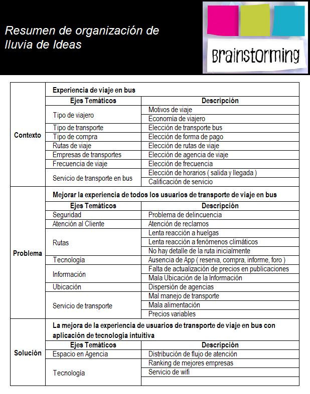

# SQUAD: GeekDesign

### INTEGRANTES:
- Anaís
- Silvia
- Mariela
- Victoria
- Quiñones Jauregui, Yenny Elizabeth - yenny.quinones.jauregui@gmail.com

## RETO : NUEVA EXPERIENCIA EN EMPRESAS DE BUSES
Nos ha contactado Catalina una emprendedora viajera con una idea de negocio. Durante sus últimas vacaciones Catalina estuvo viajando por todo latinoamérica. Durante estos viajes Catalina tuvo que tomar muchos buses de todo tipo para llegar a ver los paisajes más lindos del continente. Durante sus viajes Catalina se dio cuenta que existen aún muchas oportunidades para mejorar la experiencia de todos los usuarios de este tipo de transporte: horarios, embarques, desembarques, compra de tickets en los terminales, compra de tickets online, cancelaciones, cambios de pasajes, etc. Adicionalmente, Catalina se dio cuenta que todas las plataformas de venta de tickets de bus tienen cosas por mejorar en Chile, Perú y México.

Luego de vivir todo esto, Catalina está pensando en emprender en este sector. Para ello ha contratado a tu squad para que la ayude a investigar más sobre los usuarios de este tipo de transportes y para que definan y prueben un MVP.

Con tu asesoría, ella podrá sustentar su idea de negocio a un grupo de inversión y así obtener el financiamiento necesario para emprender su negocio y mejorar la experiencia en este rubro."

## Organización de Equipo
Objetivos:
- Trabajo en Equipo
- Aprendizaje conjunto
- Roles iguales
- Colaboración
- Mejora continua

Actividades:
- Lluvia de ideas para abordar problema de reto
- Identificación de Ejes temáticos del problema
  Para lo cual se muestra el siguiente cuadro resumen:
 
- Definición de Plan de Investigación "Fase de Descubrimiento"
- Elaboración de Preguntas para Entrevista y Encuesta
- Elaboración de Cronograma de actividades
- Feedback
- Retrospectiva

Herramientas:
- Trello
- Brainstorming
- Grabadora de sonido
- Fotos
- Formularios Google
- Slack, WatsApp, Facebook, Search Google

# Proceso UX Research 

### Objetivo general:

Atender las necesidades de Catalina...según lms.laboratoria.(seccion por modificar segun avance)

### Objetivo inicial (Lunes 29/01/18)
 *Conocer la experiencia del usuario cuando usa una agencia de Bus interprovincial.*

### Planificación de actividades (Fase de descubrimiento)
Hora           | Actividad 
---------------|----------------------------------------------------------------------------------------
```5:00 pm ``` | Brainstorming de las experiencias personales de la integrantes del squad como usuarias de una agencia de bus interprovincial.

```5:15pm```   | Affinity Map (Brainstorming)

```5:20 pm ``` | Brainstorming: Posibles soluciones a la problemática en base a experiencias personales.

```5:35 pm ``` | Affinity Map (Brainstorming).

```5:40 pm```  | Retrospectiva.

```5:50 pm```  | Planteamiento de metodologías UX Research en base al objetivo inicial:

- [ ] Trabajo de campo / entrevistas a usuarios.
- [ ] Encuestas online.
- [ ] Entrevistas a un experto.

Que mediante el trabajo de campo, entrevistas presenciales con el usuario y encuestas online se aborda de manera óptima la primera fase de descubrimiento .

```6:00 pm```  Formulación de preguntas para las entrevistas personales y encuestas virtuales

*colgar imagen de la encuesta

```7:50 pm```  Retrospectiva

```8:00 pm```  Finalización de formulario de preguntas y encuestas virtuales.

 1. Fijar y definir los espacios en donde se va realizar las entrevistas (Terminales terrestres)
 2. División en subgrupos para el trabajo de campo y horario de trabajo (grupo de 2 y 3 integrantes)
     - Inicio de trabajo:8:00 am.
     * Gpo A: Anais, Mariela y Yenny (Terminal Javier Prado y 28 de Julio).
     * Gpo B: Victoria y Silvia (Terminal Plaza Lima-Norte).

```8:30 pm```  Realizacion de speech para entrevista y selección de tipo incentivo al entrevistado

```9:00 pm```  Retrospectiva


#### Procedimiento de actividades para el dia martes 30/01/18


```8:00 am``` Inicio de trabajo de campo de acuerdo al lugar y grupo de trabajo

```8:20 am```  Etapa de observación del ambiente y como se comporta el usuario en este

```10:00 am```  Feedback (N°1) entre los integrantes del subgrupos respecto al desenvolvimiento con el entrevistado

```11:30 am```  Finalización de las entrevistas (Denegación de solicitud de  permiso para realizar encuesta).
	*adjuntar imagen de correo

```12:00 ``` Retrospectivas de las actividades realizadas:
######  Grupo terminal Javier Prado -  28 de Julio
- Investigar sobre normatividad y reglamentos de atención en empresas de transporte terrestre
  para mayor conocimiento del contexto.
- Elaborar diagrama de contexto por zonas de atención al cliente (espacio físico).
- Elaborar diagrama de contexto por formas de pago de cliente ( online y presencial).
- Elaborar diagrama de caso de uso por tipo de cliente según los resultados de entrevistas
- Elaborar grupo nro 2 de preguntas presenciales, priorizando con preguntas específicas según los
  resultados de las entrevistas realizadas.
- Elaborar grupo nro 2 de encuesta online, priorizando con preguntas específicas según los
  resultados de las encuestas online realizadas.

```02:00 ``` Reunión para conclusiones.

######  Grupo terminal Plaza Lima-Norte
-  Investigar sobre los requerimientos para realizar encuestas en los terminales de bus
-  Replantear que  preguntas se establecen con opciones múltiples y cuales con espacio para responder.
-  Preparar  material a usar en las entrevistas: copias, incentivos
-  Documentación audiovisual

```2:30pm```   Entrevista a la experta Dra. Mariel Quea (Administradora de Empresas   Hosteleras y Licenciada en Educación,Magister en Ecoturismo y Magister en Gestión Educativa. Ejecutiva en gestión y evaluación de calidad en empresas hoteleras y turísticas.)

######  Actividades comunes en Grupo
```3:00 pm```   Creacion y actualización de espacios de documentacion (Github ,Google Docs y Google Drive)
```3:10 pm```   Compilación de la data recolectada en las entrevistas presenciales
```5:00 pm```   Análisis e interpretación de la información recabada
```6:00 pm```   Investigación de otras fuentes de información (foros, reclamos de usuarios en las redes sociales de las agencias de bus interprovincial)

#### Conclusiones primarias

1.  Se encontró distintos tipos de viajeros:
 - Viajeros economicos
 - Viajeros premium
 - Viajeros laborales
 - Viajeros frecuentes
 - Viajeros poco frecuentes
 - Viajeros por motivos familiares
 - Viajeros de emergencia
 - Viajeros por turismo

2. El usuario es consciente de las condiciones que cubre un pasaje económico vs pasaje premium.

3. El usuario valora que las empresas cumplan con los servicios ofrecidos al momento de realizar la compra del pasaje Y/o de buscar información en la su web.
4. El usuario espera que la empresas sean congruentes con las condiciones de servicios  ofrecidas de acuerdo al precio del pasaje, y que esto se cumpla con mayor responsabilidad en situaciones de alza de precios por temporadas altas.
5. Para un grupo de usuarios, importa mucho que los precios de los pasajes se mantengan fijos ante cualquier temporada
6. Las necesidades del usuario van de acuerdo a los diferentes rangos de edad.
7. Apuntar observaciones de lenguaje corporal
8. Los usuarios cuando tienen rutas largas prefieren viajar durante la noche.
9. El usuarios define como buen servicio de viaje de bus, lo siguientes aspectos:
- Atención del personal.
- Alimentación.
- Limpieza
- Comodidad
- Seguridad
- Precio
- Entretenimiento
- Puntualidad de horarios
- Información
- Servicios adicionales : zona de cargadores, zona wifi.
- App
- Manejo del chofer del transporte bus
10. Según el personal de atención de informes , los usuarios suelen no leer todas las especificaciones del 
servicio, provocándoles expectativas de servicios no reales.
11. Según la observación directa de las agencias visitadas no cuentan con los medios audiovisuales necesarios que orienten a los usuarios.
12. Según las consultas realizadas en los módulos de informes de las agencias visitadas, los precios que se
encuentran publicados no son los precios actualizados, lo cual fue evidenciado cuando para absolver la pregunta tenían que revisar su aplicativo interno.


### Plan Research
- Fase Nro 1 ("Fase de Descubrimiento")

1. Objetivos
   - Identificar patrones
2. Hipótesis
    - "La mejora de la experiencia de usuarios de transporte de viaje en bus con aplicación de tecnología intuitiva"
3. Métodos.
   Estudio en Campo - Entrevistas
4. Técnicas:
    - Observación
    - Comprensión ( Modelo Mental )
    - Análisis
5. Conducta
6. Sintetizar
7. Feedback
8. Retrospectiva

#### Recopilación y Sintesis de Datos en la "Fase de Descubrimiento"

1- Método : Estudio en campo.
 1.1- Objetivos
   - Identificación del contexto
   - Identificación de Partes Interesadas
   - Identificación de Usuarios Finales insitu real.

 1.2- Research Cualitativo - Entrevistas a Usuarios
   * Entrevistas de contexto
   * Entrevistas presenciales
   * Encuesta online

 1.3- Conclusiones de Entrevistas
   * Identificación de Contexto ( cultural, uso )
        

   * Identificación de Partes Interesadas ( Diagrama de Stakeholders )
        

   * Identificación de Usuarios Finales insitu real:
        - Necesidades y Objetivos
        - uso de las instalaciones
        - comportamiento
        - conocimiento
        - experiencia
        - preocupaciones
        

   * Conclusiones de entrevistas
         a. Entrevistas de contexto
         b. Entrevistas presenciales
         c. Encuesta online
   * Perfiles de usuarios

2- Revisión de Data ya existente.
  2.1- revisión de literatura del proceso ( normativa )
  2.2- revisión de data existente ( foros, comunidades)
  2.3- Research Cuantitativo: revisión de análisis existente ( conclusiones ya existentes, estudios,
       investigaciones).

##### Proceso de Elaboración de Entrevista y Encuesta

## Links de Referencia
-
